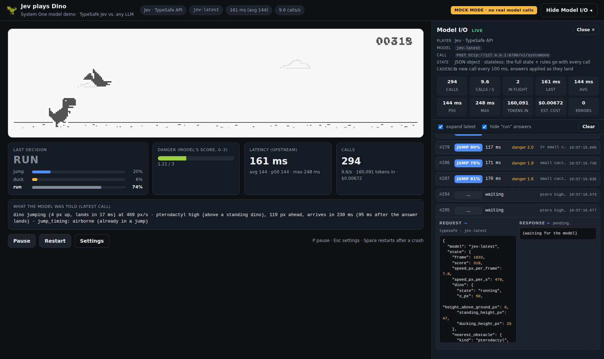

# Jev plays Dino 🦖

Chrome's T-Rex runner, played live by **Jev** — TypeSafe AI's *System One* decision model — or by any LLM on
OpenRouter, with a collapsible panel that shows every model call and answer in real time.



Several times a second the game turns its state into text, asks one typed question
(*"which key should be pressed right now?"*), presses the key the model picks, and asks again.
Nothing is remembered between calls. Jev answers in roughly 100–300 ms without generating a single token of text;
an LLM needs one to several seconds and usually dies on the first cactus. That contrast is the demo.

---

## Quick start (two minutes)

1. Install **Node.js 20 or newer** from https://nodejs.org. Nothing else to install: no `npm install`, no build.
2. Open `config.mjs` (next to `server.mjs`) and check the keys (the Jev key is already in; add an OpenRouter
   key for the LLM comparison):

   ```js
   export const KEYS = {
     TYPESAFE_API_KEY: 'apikey_…',                     // Jev — https://console.typesafe.ai
     OPENROUTER_API_KEY: 'PASTE_OPENROUTER_KEY_HERE',  // optional — https://openrouter.ai/keys
   };
   ```

3. Start the server from the folder that contains `server.mjs`, then open the page:

   ```bash
   node server.mjs        # → http://localhost:8787
   ```

4. Pick a player, set the speed, press **Start**. The **Show Model I/O** button (top right) opens the live panel
   with every call and answer.

* **No keys yet?** `node server.mjs --mock` runs the whole thing against an offline imitation of both APIs.
* **Before a demo:** press **Test call** on the Jev card a few times. It makes one real request, shows the latency,
  and seeds the game's latency estimate with the measurement.
* Players whose key is missing are greyed out and say which line of `config.mjs` to fill. Environment variables
  with the same names work as a fallback.

The keys are only ever read by `server.mjs`; the browser talks to the local server, which adds the
`Authorization` header. This is also *required*: `api.typesafe.ai` rejects browser origins (CORS).

---

## What is Jev? (2-minute primer)

* **Made by TypeSafe AI**, announced 15 September 2026 (founder Diogo Almeida, formerly OpenAI; $40M raised).
  Sources: [TypeSafe blog](https://typesafe.ai/blog/introducing-system-one-models-and-jev),
  [API reference](https://docs.typesafe.ai/api), [DataCamp](https://www.datacamp.com/blog/system-one-models-jev),
  [MindStudio](https://www.mindstudio.ai/blog/jev-system-one-model-classification),
  [OpenRouter listing](https://openrouter.ai/typesafe/jev-1.13).
* **It does not generate text.** You send a *state* (any text or JSON) plus a map of named, typed *questions*;
  it returns one typed answer per question, all in a single parallel pass, each with calibrated probabilities.
  Three question types:

  | type | you give | you get back |
  |------|----------|--------------|
  | `choice` | labels + descriptions | the chosen label, a probability for **every** label, a confidence |
  | `score` | an ordered rubric (2–10 levels) | expected score (can fall between levels), per-level probabilities, confidence |
  | `noul` | a yes/no statement | probability that it is true (0–1) |

* **Fast and cheap:** 70–500 ms end to end, $0.042 per million input tokens, output tokens free
  (about $0.0004 per decision). 0 % structured-output errors: the answer is always one of your labels.
* **Stateless and "not very intelligent" by design.** No memory, no chain of thought, roughly 32k input tokens.
  It is a semantic classifier / router / risk gate, not a planner. Put the physics in code, ask it for the judgment.
* **One endpoint:** `POST https://api.typesafe.ai/v1/systemone` with `Authorization: Bearer $TYPESAFE_API_KEY`.
  Official SDKs: `npm i @typesafe-ai/sdk`, `pip install typesafe-sdk`. On OpenRouter the same body goes to
  `POST https://openrouter.ai/api/alpha/decisions` (model `typesafe/jev-1.13`); it is *not* a chat-completions model.

### The exact request the game sends to Jev

```json
{
  "model": "jev-latest",
  "state": {
    "frame": 812, "score": 143,
    "speed_px_per_frame": 6, "speed_px_per_s": 360,
    "dino": { "state": "running", "x_px": 50, "height_above_ground_px": 0, "standing_height_px": 47, "ducking_height_px": 25 },
    "nearest_obstacle": {
      "kind": "cactus", "size": "large", "count": 2, "width_px": 50, "height_px": 50,
      "distance_px": 210, "arrives_in_ms": 583, "arrives_in_ms_when_answer_lands": 420,
      "jump_timing": "now"
    },
    "next_obstacle": { "kind": "pterodactyl", "flying_height": "mid (at head height of a standing dino)", "width_px": 46, "height_px": 40, "distance_px": 640, "arrives_in_ms": 1777 },
    "timing": { "your_recent_latency_ms": 163, "jump_airtime_ms": 583, "jump_apex_px": 92 }
  },
  "questions": {
    "action": {
      "type": "choice",
      "instructions": "You are the reflexes of the T-Rex ... Which input should the game press right now?",
      "criteria": { "jump": "Press the jump key now.", "duck": "Hold the duck key now ...", "run": "Press nothing: keep running." }
    },
    "danger": {
      "type": "score",
      "instructions": "How dangerous is the situation for the dino right now?",
      "criteria": ["safe: nothing is close", "caution: ...", "urgent: ...", "critical: ..."]
    }
  }
}
```

### …and what comes back

```json
{
  "model": "jev-1.13.0",
  "answers": {
    "action": { "type": "choice", "choice": "jump", "confidence": 0.93, "probabilities": { "jump": 0.93, "duck": 0.01, "run": 0.06 } },
    "danger": { "type": "score", "score": 2.1, "confidence": 0.8, "legend": { "0": "safe: ...", "1": "...", "2": "...", "3": "..." }, "probabilities": { "0": 0.01, "1": 0.09, "2": 0.7, "3": 0.2 } }
  },
  "usage": { "input_tokens": 410, "output_tokens": 0 }
}
```

The engine plans a jump for obstacle #… and presses the key at the first frame where the jump gets through
(see below). The `danger` score drives the meter under the canvas. Both answers came from the same single call —
adding questions adds almost no latency.

For the LLM player the *same* state and rules are sent as a system + user prompt to
`POST /api/v1/chat/completions` with a strict JSON schema (`{"action","danger","reason"}`), and the reply is parsed.

---

## How the loop works

```
 every frame (60 fps)                 as fast as answers arrive (sequential, one call in flight)
 ┌──────────────┐  snapshot()  ┌────────────────────────────────────────────────────────────┐
 │  game engine │ ───────────► │  agent: physics facts → state text → POST /api/decide     │
 │  (canvas)    │ ◄─────────── │  ← parse typed answer → jump() / setDuck() / nothing        │
 └──────────────┘  press key   └───────────────┬────────────────────────────────────────────┘
                                                │ local server adds the key, forwards, times it
                                                ▼
                     TypeSafe /v1/systemone · OpenRouter /api/alpha/decisions · OpenRouter /api/v1/chat/completions
```

* **The model decides what, the engine decides when.** Distances and arrival times are measured in code. When the
  model answers `jump` for an obstacle, the engine simulates the real jump curve against Chromium's collision
  boxes every frame and presses the key at the first frame where the jump gets through (after landing, if the dino
  is airborne). `duck` crouches shortly before the obstacle and holds until it has passed. `run` plans nothing.
  So one correct answer per obstacle is enough, as long as it arrives before the jump window closes. That is the
  real constraint on latency: an obstacle appears at the right edge of the screen about 1.4 s before contact at
  speed 6 (2.8 s at speed 3), and consecutive obstacles can be under a second apart, so a 400 ms model has time to
  spare while a 2 s model rarely survives more than a few obstacles even at speed 3. The model's job is the
  judgment (jump a cactus, duck a mid pterodactyl, ignore a high one), which is the same division of labour the
  other Jev game harnesses use. The call also asks about the obstacle after the nearest one, so a plan can be in
  place before it becomes urgent; Jev answers both questions in the same pass.
* **Why not press the key when the answer lands?** That is the *reflex* option in Advanced, and it is a good
  five-minute demo of why not: a jump only clears a cactus if it starts inside a window of roughly 250–330 ms,
  Chrome spawns the next obstacle as little as 0.6 s after the previous one, and a jump lasts 0.58 s. A model
  with 300–500 ms latency misses the window every third obstacle and can never manage the back-to-back pairs.
* **Stateless.** The full state and the rules travel with every call. Jev has no context window to fill up and
  no memory of the previous frame, which is why the state includes everything it needs.
* **Latency still matters.** Answers describe the world as it was when the request left; the panel shows how old
  that state was when each answer landed and how many ms were left to spare. Calls go out every 300 ms with at
  most two in flight: more than that queued up at the API in testing and every answer arrived late.

---

## Players

| player | what happens | typical latency |
|--------|--------------|-----------------|
| **Jev — TypeSafe API** | `POST api.typesafe.ai/v1/systemone`, model `jev-latest` | ~100–300 ms |
| **Jev — via OpenRouter** | same body to `openrouter.ai/api/alpha/decisions`, model `typesafe/jev-1.13` | ~150–400 ms |
| **Any LLM — via OpenRouter** | chat completion with a JSON schema; pick any model id (live list is loaded); survives only at low speed | 0.7–10 s |
| **Scripted bot** | a fixed if/else on the same state with a latency slider — shows what latency alone does | you choose |
| **You** | keyboard (Space/↑ jump, ↓ duck) — set the human reference score | — |

## Settings

* **Speed** 3–13 px/frame (Chrome starts at 6, caps at 13) and **accelerate over time**.
* **Advanced:** who times the key press (harness-timed, or reflex) · state as JSON or plain sentences · timing
  assist (reflex only) · second question (danger score) on/off · call cadence (every N ms with at most 2 in
  flight, or one at a time) · show hitboxes.
* The **Model I/O** panel (button top right) lists every call with the exact request body, the raw response,
  upstream latency, tokens, running cost, and the probability bars behind each decision. "Hide run answers"
  keeps only the interesting ones on screen; "expand latest" keeps the newest call open for the projector.

## A demo script that works

1. **You play** one round — the human reference.
2. **Scripted bot** at 150 ms, then at 1500 ms latency. Same logic, only latency changes; the second one dies.
3. **Jev** at speed 6 with the panel open. Point at: calls per second, the probabilities on every answer,
   the danger score coming from the *same* call, zero parsing errors, the running cost.
4. **An LLM** (e.g. `openai/gpt-4o-mini`, then something bigger). At speed 6 it dies on the first obstacle: the
   obstacle is on screen for 1.4 s and the answer takes longer. Drop the speed to 3 and a fast small model can
   manage a few obstacles. Point at: latency, "state was N ms old when the answer landed", the `reason` text it
   insists on writing, cost per call.
5. Back to **Jev**, Advanced → **Reflex** execution, and watch it die on the third obstacle: the answers are the
   same, only the timing responsibility moved. Then state format **plain text**, and discuss what belongs in code
   versus in the model.

---

## Files

```
./
├─ server.mjs            static files + /api/decide, /api/models, /api/ping, /api/config (keys never leave here)
├─ config.mjs            ← PASTE KEYS HERE; model names, port, pricing
├─ dev/mock-upstream.mjs offline imitation of both APIs (node server.mjs --mock)
├─ docs/screenshot.png
└─ public/
   ├─ index.html, styles.css
   ├─ js/game.js         the runner: Chromium's physics, sprites, collision boxes; snapshot(); jumpProfile()
   ├─ js/agent.js        state builder, Jev/OpenRouter payloads, parsers, the decision loop
   ├─ js/panel.js        live Model I/O panel
   ├─ js/ui.js           start screen, HUD, keyboard, overlay
   └─ assets/            Chrome's sprite sheet (© The Chromium Authors, BSD-3-Clause)
```

## Notes

* OpenRouter's Decisions endpoint is under `/api/alpha/` and may move; the path is in `server.mjs`. If the model id
  `typesafe/jev-1.13` returns 404, use the id shown on https://openrouter.ai/typesafe (editable on the card).
* Models that reject `response_format` or `temperature` are retried automatically with a simpler request.
* Cost: Jev at ~450 input tokens per call and 3 calls/s is about $0.20 per hour of play.
* Keys in `config.mjs` are hardcoded on purpose for this demo, and the Jev key is committed. Keep the repository
  private; rotate the key at https://console.typesafe.ai if the repository is ever shared more widely.
